## Lab 1 - Introduction to OpenCV

1.1)
Pour pouvoir lire une vidéo, on utilise 'cv::VideoCapture'.
<pre><code>cv::VideoCapture cap;
cap.open(videoFilename);</code></pre>

Les images d'OpenCV sont stockées dans des 'cv::Mat' et pour récupérer les frames d'un 'cv::VideoCapture', il suffit d'utiliser l'opérateur de flux '<<'.
<pre><code>cv::Mat frameBGR;
cap >> frameBGR;</code></pre>

Pour convertir une frame (en format BGR par exemple) en une autre (en format YCrCb par exemple), on utilise 'cvtColor'.
<pre><code>cv::Mat frameYCRCB;
cvtColor(frameBGR, frameYCRCB, CV_BGR2YCrCb);
// 'cvtColor' convertie frameBGR en YCrCb et stocke le résultat dans frameYCRCB.</code></pre>

Si l'on souhaite rajouter du delay (par exemple entre l'affichage de 2 frames), on utilise 'waitKey'.
<pre><code>cv::waitKey(30); // delai de 30ms</code></pre>

Pour afficher une frame on utilise 'imshow'.
<pre><code>imshow("frameBGR", frameBGR);</code></pre>

Pour sauvegarder une image on utilise 'imwrite'.
<pre><code>cv::imwrite("frameBGR.png", frameBGR);</code></pre>

1.3) J'ai calculé et affiché le MSE/PSNR/Entropy du fichier vidéo 'Birds_720.MOV' avec une frame de décalage.  
Le MSE (*Mean Square Error*) entre deux frames uniquement sur le canal Y permet de voir le constrast
le déplacement de la caméra.
<figure>
    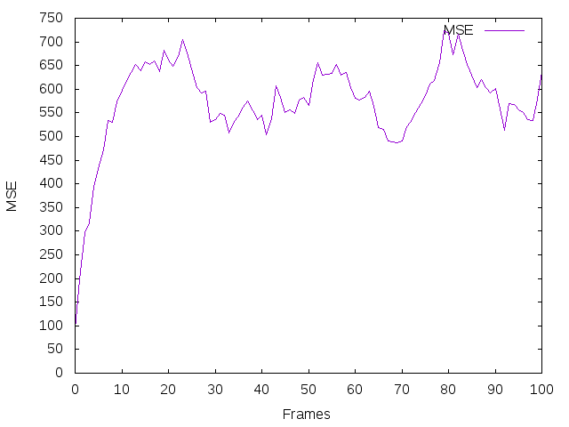
    <figcaption>MSE - Birds</figcaption>
</figure>
<figure>
    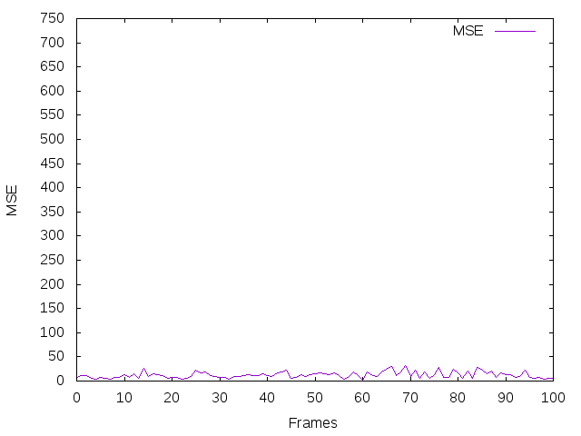
    <figcaption>MSE - Cars</figcaption>
</figure>
<figure>
    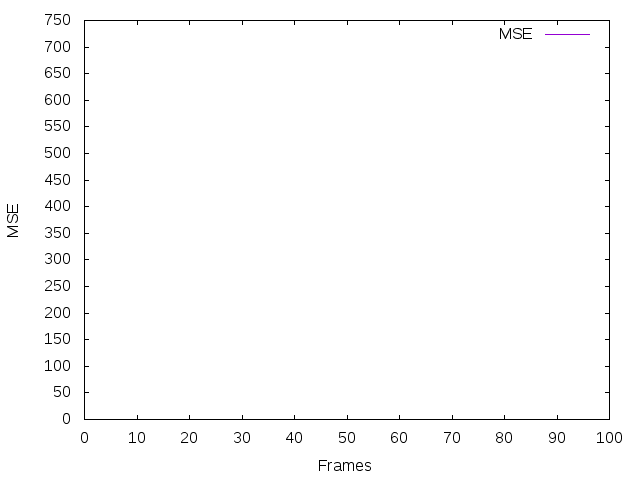
    <figcaption>MSE - Birds</figcaption>
</figure>
<figure>
    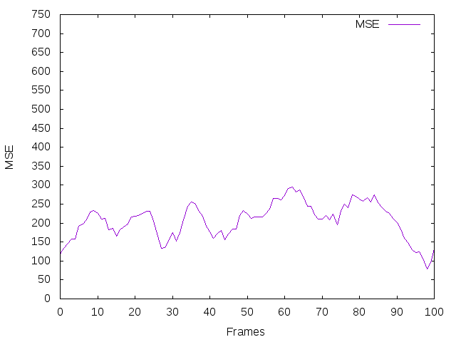
    <figcaption>MSE - Cars</figcaption>
</figure>

<figure>
    
    <figcaption>PSNR - Birds</figcaption>
</figure>
<figure>
    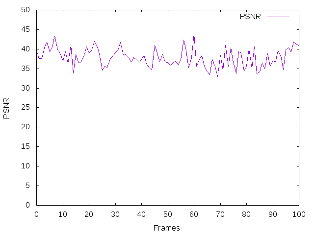
    <figcaption>PSNR - Cars</figcaption>
</figure>
<figure>
    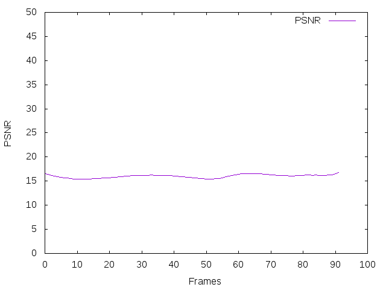
    <figcaption>PSNR - Birds</figcaption>
</figure>
<figure>
    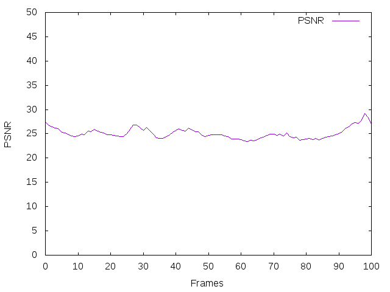
    <figcaption>PSNR - Cars</figcaption>
</figure>

<figure>
    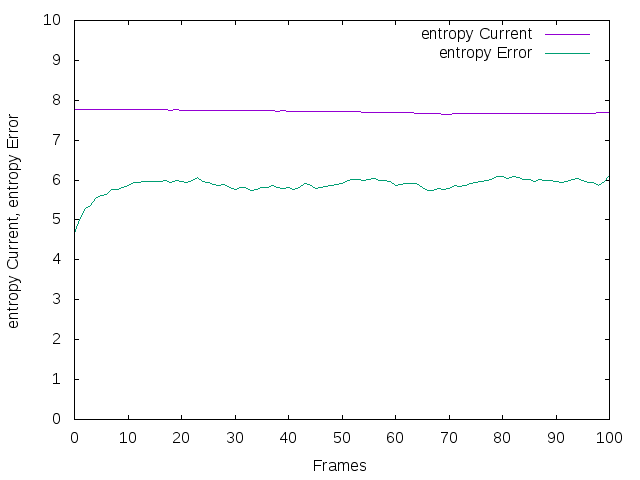
    <figcaption>Entropy - Birds</figcaption>
</figure>
<figure>
    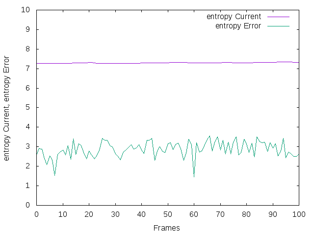
    <figcaption>Entropy - Cars</figcaption>
</figure>
<figure>
    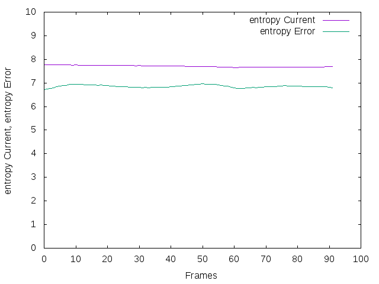
    <figcaption>Entropy - Birds</figcaption>
</figure>
<figure>
    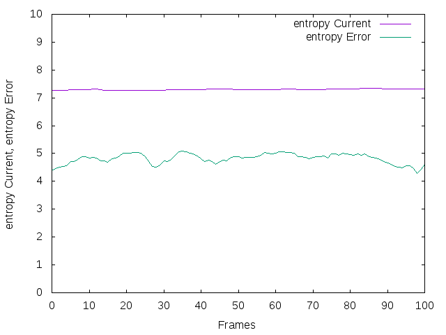
    <figcaption>Entropy - Cars</figcaption>
</figure>
