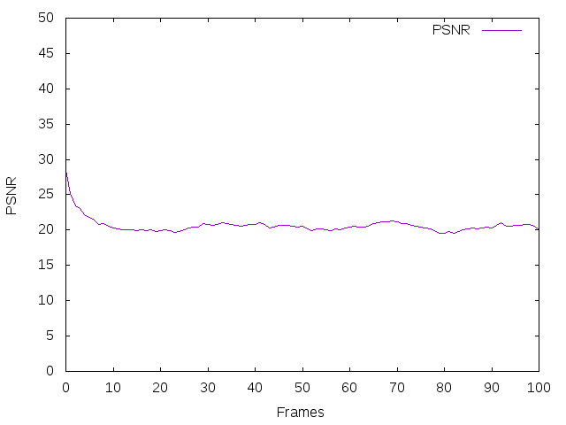

## Lab 1 - Introduction to OpenCV

1.1)
Pour pouvoir lire une vidéo, on utilise 'cv::VideoCapture'.
<pre><code>cv::VideoCapture cap;
cap.open(videoFilename);</code></pre>

Les images d'OpenCV sont stockées dans des 'cv::Mat' et pour récupérer les frames d'un 'cv::VideoCapture', il suffit d'utiliser l'opérateur de flux '<<'.
<pre><code>cv::Mat frameBGR;
cap >> frameBGR;</code></pre>

Pour convertir une frame (en format BGR par exemple) en une autre (en format YCrCb par exemple), on utilise 'cvtColor'.
<pre><code>cv::Mat frameYCRCB;
cvtColor(frameBGR, frameYCRCB, CV_BGR2YCrCb);
// 'cvtColor' convertie frameBGR en YCrCb et stocke le résultat dans frameYCRCB.</code></pre>

Si l'on souhaite rajouter du delay (par exemple entre l'affichage de 2 frames), on utilise 'waitKey'.
<pre><code>cv::waitKey(30); // delai de 30ms</code></pre>

Pour afficher une frame on utilise 'imshow'.
<pre><code>imshow("frameBGR", frameBGR);</code></pre>

Pour sauvegarder une image on utilise 'imwrite'.
<pre><code>cv::imwrite("frameBGR.png", frameBGR);</code></pre>

1.3) La MSE (*Mean Square Error*) permet de détecter les constrastes et les mouvements entre les deux frames. Dans notre cas, nous utilisons la MSE sur le canal Y (de YCrCb).  
La figure 1 montre la MSE effectuée sur la vidéo "Birds_720.MOV" et la figure 2 la MSE effectuée sur la vidéo "SmallCars_720.MOV". Les deux figures ont été réalisé avec une seule frame de décalage. On remarque que la MSE est beaucoup plus élevée dans la figure 1 que dans la figure 2. On peut ainsi en déduire qu'il y a plus de mouvement dans la vidéo "Birds", et qu'il n'y a presque pas de mouvement dans la vidéo "SmallCars". Par mouvement, on entend "déplacement de pixel", ce qui est le cas dans la vidéo sur les "Birds" où la caméra se déplace fortement alors qu'elle est plutôt statique dans la vidéo "SmallCars".
<figure>
    
    <figcaption style="text-align:center">Figure 1 - MSE (Birds, delta = 1)</figcaption>
</figure>
<figure>
    
    <figcaption style="text-align:center">Figure 2 - MSE (SmallCars, delta = 1)</figcaption>
</figure>

Le PSNR (*Peak Signal to Noise Ratio*) permet de quantifier la qualité de reconstruction d'une image compressée par rapport à l'image originale. Toutefois, le PSNR ne permet pas de déterminer la qualité visuelle d'une image. Plus le PSNR est élévé, plus l'image compressée est proche de l'originale.   
La figure 3 montre le PSNR effectué sur la vidéo "Birds_720.MOV" et la figure 4 montre le PSNR effectué sur la vidéo "SmallCars_720.MOV". Les deux figures ont été réalisé avec une seule frame de décalage. On remarque que la figure 4 possède des valeurs comprise entre 30 et 50 ce qui démontre que la vidéo "SmallCars" n'a pas eu beaucoup de perte lors de la compression : ce sont des valeurs normales de PSNR (pour des pixels codés sur 8 bits). La figure 3 quant à elle affiche des valeurs comprises entre 20 et 25 : ce sont des valeurs acceptables mais cela montre qu'il y a eu plus de perte de données lors de la compression des images, que pour la vidéo "Birds".

<figure>
    
    <figcaption style="text-align:center">Figure 3 - PSNR (Birds, delta = 1)</figcaption>
</figure>
<figure>
    
    <figcaption style="text-align:center">Figure 4 - PSNR (SmallCars, delta = 1)</figcaption>
</figure>

L'entropie permet de mesurer la quantité d'information contenue dans une source d'information, dans notre cas une frame.
Plus l'entropy est élévée, plus il y a d'informations contenue dans la frame.
La figure 5 montre l'entropie (Current et Error) effectué sur la vidéo "Birds_720.MOV" et la figure 6 montre l'entropie (Current et Error) effectué sur la vidéo "SmallCars_720.MOV". L'entropie Current permet d'avoir un référentiel sur la quantité d'information présente dans chaque frame tandis que l'entropie Error permet de savoir la différence de quantité d'information entre deux frames consécutives. Ainsi, on remarque que la vidéo "Birds" possède une entropie Error aux alentours de 6 et une entropie Current aux alentours de 8. Cela nous informe qu'entre deux frames, il y a toujours beaucoup d'informations et donc qu'il y a eu du mouvement. Au contraire, dans la vidéo "SmallCars", l'entropie Current est aux alentours de 7 alors que son entropie Error tourne autour de 2-3. On peut donc en déduire qu'il y a peu d'information entre 2 frames consécutives et donc qu'il n'y a pas beaucoup de mouvement entre les deux frames.
<figure>
    
    <figcaption style="text-align:center">Figure 5 - Entropy (Birds)</figcaption>
</figure>
<figure>
    
    <figcaption style="text-align:center">Figure 6 - Entropy (SmallCars)</figcaption>
</figure>
