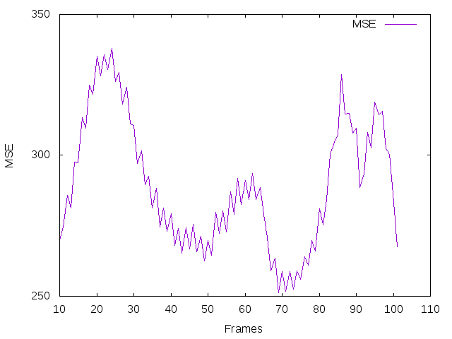
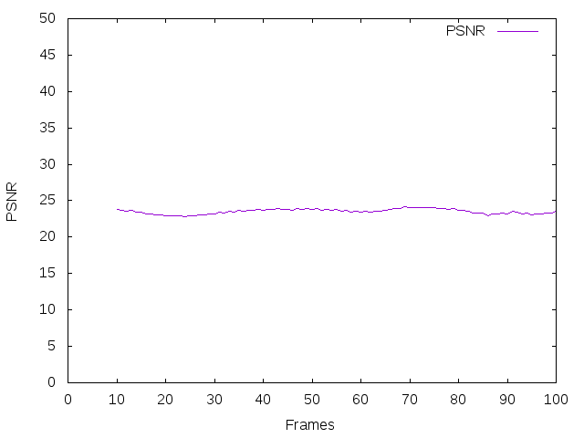
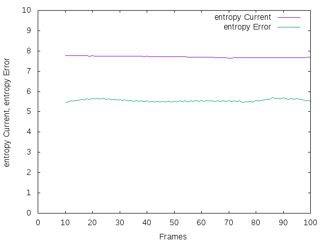

## Lab 2 - Motion estimation in video sequences

1.1)

Les figures 1,2 et 3 ont été généré à l'aide des paramètres suivants :
<ul>
  <li> Δt = 10</li>
  <li> taille des blocks = 8</li>
  <li> taille de la fenêtre = 32</li>
</ul>

Nous avons calculé, à l'aide de l'image précédentes et des vecteurs de mouvements, une image compensée. Nous avons ensuite calculé la MSE entre cette image compensée et l'image actuelle (figure 1). La MSE étant très faible (entre 250 et 350), nous pouvons en déduire que les deux images sont trés proches. Il y a donc eu peu de déplacement de pixel et notre image compensée correspond bien à notre image actuelle.
<figure>
    
    <figcaption style="text-align:center">Figure 1 - MSE (entre Current Image et Compensated Image)</figcaption>
</figure>

Le PSNR entre l'image compensée et l'image actuelle (figure 2) montre des valeurs entre 20 et 25.
<figure>
    
    <figcaption style="text-align:center">Figure 2 - PSNR (entre Current Image et Compensated Image)</figcaption>
</figure>

L'entropie de l'image actuelle est aux alentours de 7.8 tandis que l'image d'erreur compensée est aux alentours de 5.5. On peut en déduire qu'il y a eu peu d'informations contenu dans l'image d'erreur compensée, ce qui est normale puisque l'image compensée est pratiquement similaire à l'image actuelle et donc qu'il y a très peu de variation entre ses deux images.
<figure>
    
    <figcaption style="text-align:center">Figure 3 - Entropy (entre Current Image et Error Compensated Image)</figcaption>
</figure>
