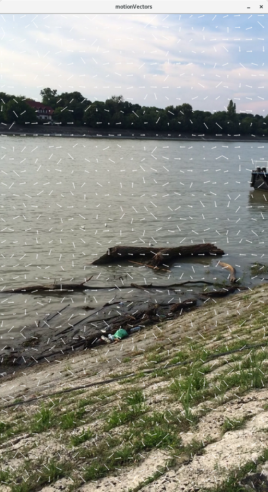
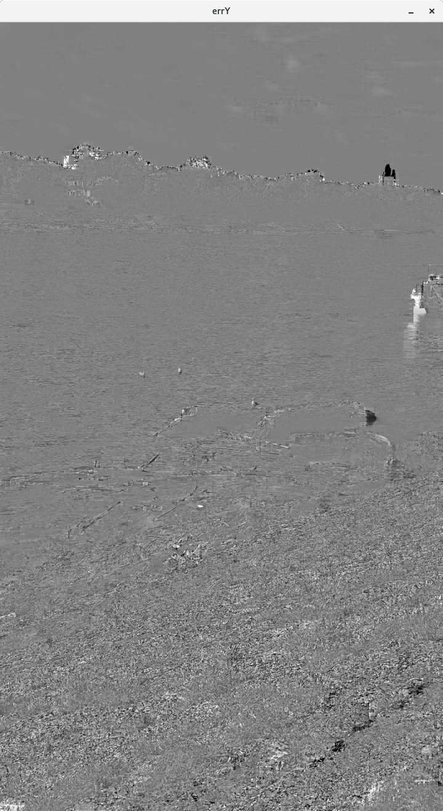
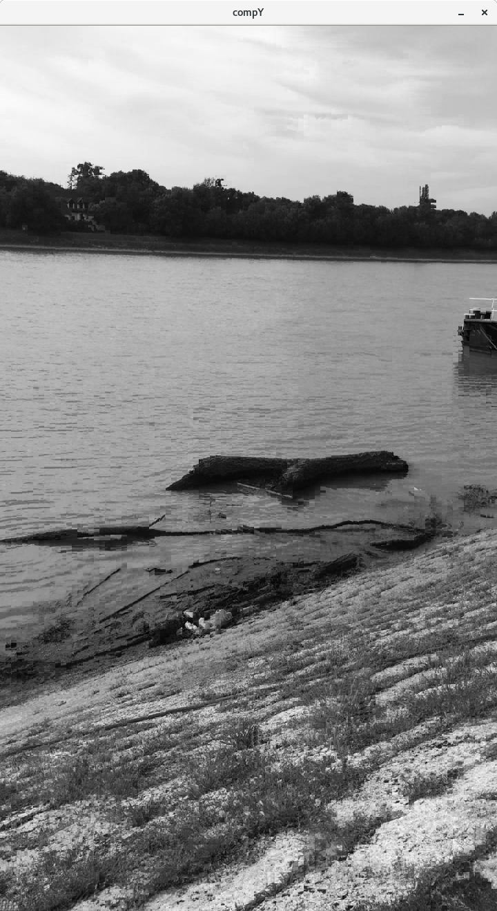
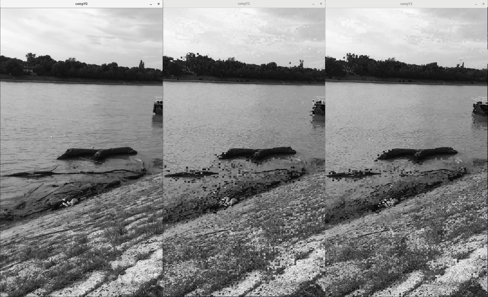
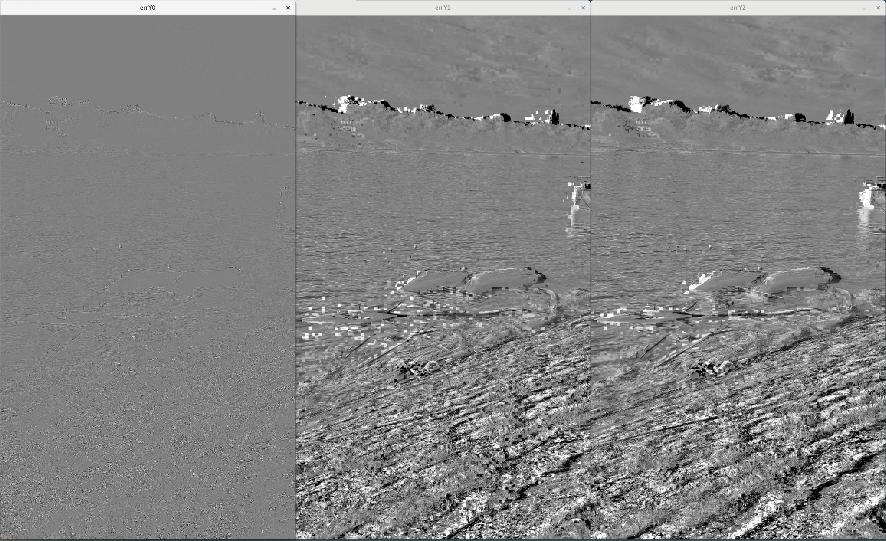
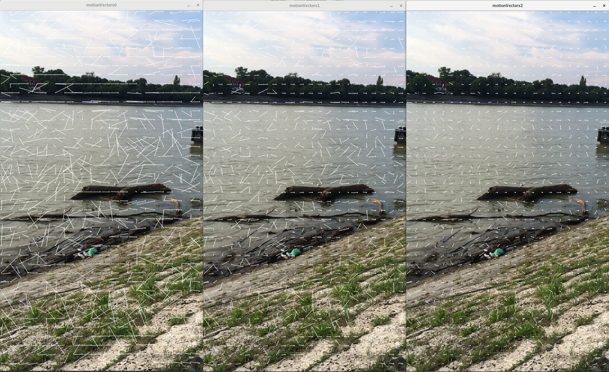
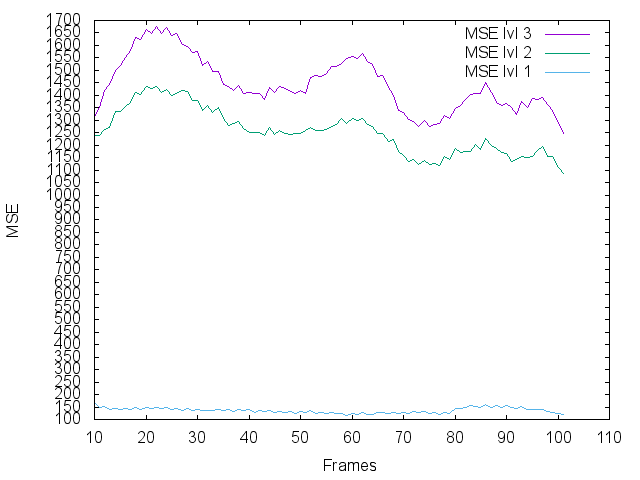
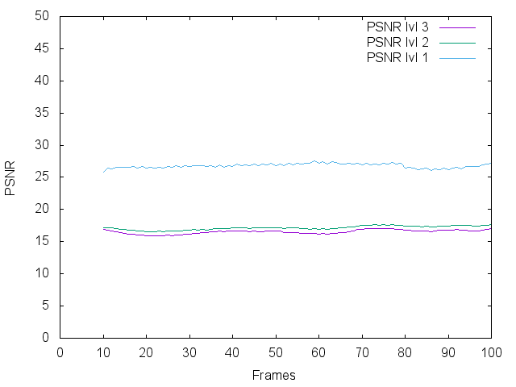
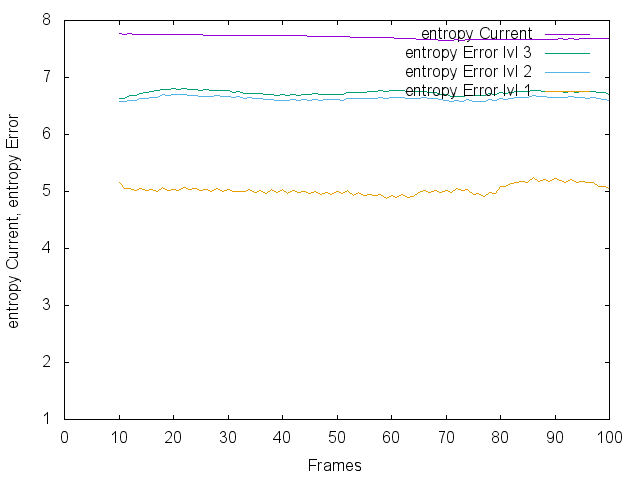

## Lab 2 - Motion estimation in video sequences

### Motion Estimation with block-matching algorithm
#### 1.1) Mono-resolution version

Les figures 1,2 et 3 ont été généré à l'aide des paramètres suivants :
<ul>
  <li> Δt = 10</li>
  <li> taille des blocks = 8</li>
  <li> taille de la fenêtre = 32</li>
</ul>

Nous avons calculé, à l'aide de l'image précédentes et des vecteurs de mouvements, une image compensée. Nous avons ensuite calculé la MSE entre cette image compensée et l'image actuelle (figure 1). La MSE étant très faible (entre 250 et 350), nous pouvons en déduire que les deux images sont trés proches. Il y a donc eu peu de déplacement de pixel et notre image compensée correspond bien à notre image actuelle.
<figure style="text-align:center">
    
    <figcaption style="text-align:center">Figure 1 - MSE (entre Current Image et Compensated Image)</figcaption>
</figure>

La PSNR entre l'image compensée et l'image actuelle (figure 2) montre des valeurs entre 20 et 25. La PSNR ici n'est pas représentative car on la fait sur deux images qui sont censé être les mêmes.
<figure style="text-align:center">
    
    <figcaption style="text-align:center">Figure 2 - PSNR (entre Current Image et Compensated Image)</figcaption>
</figure>

L'entropie permet de mesure la quantité d'informations, elle est comprise entre 1 et 8.
L'entropie de l'image actuelle étant aux alentours de 7.8, on peut en déduire que l'image d'erreur contient une grande diversité de niveau de gris. L'entropie de limage d'erreur compensée est aux alentours de 5.5. On peut en déduire qu'il y a eu peu d'informations contenu dans l'image d'erreur compensée, ce qui est normale puisque l'image compensée est pratiquement similaire à l'image actuelle et donc qu'il y a très peu de variation entre ses deux images.
<figure style="text-align:center">
    
    <figcaption style="text-align:center">Figure 3 - Entropy (entre Current Image et Error Compensated Image)</figcaption>
</figure>

Voici les images des vecteurs de mouvements, de l'image compensée et de l'image d'erreur compensée.
<figure style="text-align:center">
    
    <figcaption style="text-align:center">Figure 4 - Motion Vectors</figcaption>
</figure>

<figure style="text-align:center">
    
    <figcaption style="text-align:center">Figure 5 - Image d'erreur compensée</figcaption>
</figure>

<figure style="text-align:center">
    
    <figcaption style="text-align:center">Figure 6 - Image compensée</figcaption>
</figure>

#### 1.2) Multi-resolution version
On a implémenté l'estimation de mouvements en Multi-résolution. Le principe est d'affiner la précision des vecteurs de mouvements en recherchant les blocks à partir des vecteurs de mouvements calculés précédemment.

<figure style="text-align:center">
    
    <figcaption>Figure 7 - Image Compensée</figcaption>
</figure>

<figure style="text-align:center">
    
    <figcaption>Figure 8 - Image d'erreur</figcaption>
</figure>

<figure style="text-align:center">
    
    <figcaption>Figure 9 - Vecteurs de mouvements</figcaption>
</figure>

##### **MSE**
Dans la figure 10, on a affiché les différentes valeurs de MSE selon les différents niveaux. La MSE du niveau 3 est assez élevée car on la calcul sur une image qui a été réduit par 4 pour trouver les vecteurs de mouvements. La MSE du niveau 2 est un peu meilleure car l'image prise est deux fois plus grande que la précédentes mais elle est encore 2 fois plus petites que l'image de base. Et la MSE du niveau 1 est très bonne car on a affiner nos vecteurs de mouvements sur 3 niveaux et l'image pour trouver les motions vecteurs faisait la taille de l'image de base.
On obtient ainsi de meilleur résultat que sur la figure 1 car on a pu affiné nos vecteurs de mouvements.
<figure style="text-align:center">
    
    <figcaption>Figure 10 - MSE level 3</figcaption>
</figure>

##### **PSNR**
<figure style="text-align:center">
    
    <figcaption>Figure 11 - PSNR level 3</figcaption>
</figure>

##### **Entropy**
On remarque que les valeurs d'entropie sur l'image actuelle sont aux alentours de 7.8 et qu'il a donc de grande nuance de gris.
L'entropie au niveau 1 montre que la différence entre l'image actuelle et l'image compensée sont proche et qu'il y a peu de nuance de gris sur l'image d'erreur. De plus, on remarque que l'entropie au niveau 1 est aux alentours de 5 alors que dans la figure 3 (en mono-résolution) elle était de 5.5 et donc moins bonne.
<figure style="text-align:center">
    
    <figcaption>Figure 12 - Entropy level 3</figcaption>
</figure>
