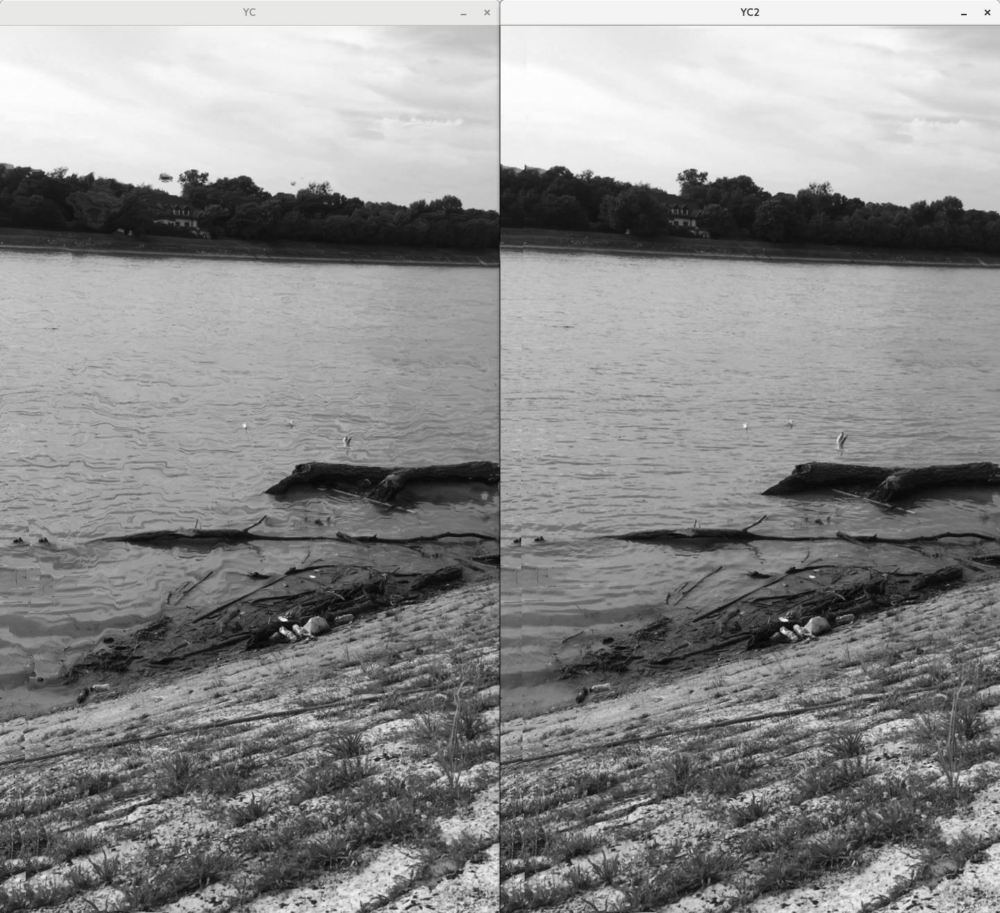

## Lab 3 - Methods of estimation of Optical Flow & Global motion estimation in the image plane with RANSAC algorithm

L'estimation de mouvement local consiste à associé à chaque pixel un vecteur de mouvement représentant son déplacement entre deux images espacés d'une ou plusieurs frames.

L'estimation de mouvement global consiste à associé à tous les pixels une transformation : une translation dans le cas d'un déplacement de caméra, une homothétie dans le cas d'un zoom de la caméra, etc.

Tous les résultats ci-dessous on était généré sur l'image Birds avec une distance entre deux images de 10 sur les ordinateurs de la salle 201 du Cremi.

### 1. Estimation of Optical Flow
L'estimation du flux optique est l'estimation de mouvement local.

#### 1.1) Horn & Schunk Method
La MSE de la méthode (figure 1) Horn & Schunk est bien plus élevé que celle de la méthode de Block Matching, mais elle est 3 fois plus rapidement (tests effectué avec 3 niveaux).
<figure style="text-align:center">
    
    <figcaption>Figure 1 - MSE</figcaption>
</figure>

|    Méthode    |     Temps    |
| ------------- |: ----------: |
| BlockMatching |    10min 17s |
| Horn & Schunk |     3min 2s  |

#### 1.2) Farneback method
La MSE de la méthode Farneback (figure 2) en mono-résolution possède une courbe similaire à la MSE de la méthode d'Horn & Schunk mais avec des valeurs inférieur (de 200 à 300).

La MSE de la méthode Farneback en multi-resolution (avec un niveau de 3) à une MSE très faible (proche de la méthode Block Matching) entre la frame 10 et 70, mais elle monte ensuite jusqu'à 700-800. Cette croissance correspond au mouvement rapidement de la caméra dans la vidéo.

<figure style="text-align:center">
    
    <figcaption>Figure 2 - MSE</figcaption>
</figure>

La méthode Farneback obtient de meilleurs MSE que la méthode Horn & Schunk et son temps de calcul approche celui de la méthode Block Matching.

|    Méthode     |     Temps    |
| -------------- |: ----------: |
| Farneback lvl1 |   2min 18s   |
| Farneback lvl3 |   2min 57s   |

#### 1.3) MIT method

La méthode MIT obtient de meilleurs résultats de MSE (figure 3) que les autres méthodes précédentes mais en contre-partie, son temps d'éxécution est de prés d'une heure et quinze minutes.

<figure style="text-align:center">
    
    <figcaption>Figure 3 - MSE</figcaption>
</figure>

|    Méthode     |     Temps    |
| -------------- |: ----------: |
|      MIT       | 1h 14min 37s |

### 2. Global Motion estimation
La GME a été faite avec la méthode Farneback. Les résultats de la MSE sont bons jusqu'à la frame 75 qui correspond au début du mouvement rapide de la caméra où les résultats deviennes trés elevé.

<figure style="text-align:center">
    
    <figcaption>Figure 4 - MSE 3</figcaption>
</figure>

|    Méthode     |     Temps    |
| -------------- |: ----------: |
| BlockMatching  |    10min 17s |
| Horn & Schunk  |     3min 2s  |
| Farneback lvl1 |     2min 57s |
|      MIT       | 1h 14min 37s |
|      GME       |    11min 28s |

<figure style="text-align:center">
    
    <figcaption>Figure 5 - Image compensée avec les vecteurs de mouvement (à gauche) et image compensée avec les vecteurs de mouvement global (à droite)</figcaption>
</figure>

<figure style="text-align:center">
    
    <figcaption>Figure 6 - Vecteurs de mouvement (à gauche), vecteurs de mouvement global (au milieu) et erreur de mouvement (à droite)</figcaption>
</figure>

On remarque que les parties avec une forte erreur de mouvement (c'est-à-dire les parties en blanche dans l'image de droite - Figure 3) correspondent aux motions vecteurs qui sont différents des vecteurs de mouvement global. Entre autres, on remarque que les oiseaux sont en claire car ils ont un déplacement différents par rapport à l'arrière plan.

### Conclusion
Les meilleurs résultats sont obtenus avec la méthode de BlockMatching (figure 6) selon le rapport qualité de MSE et vitesse de calculs. De plus, le BlockMatching est moins sensible au variation de mouvement et est assez stable. En effet, entre les frame 10 et 75, toutes les méthodes obtiennes globalement des résultats stables, mais dés que le mouvement de la caméra accèle (à partir de la frame 75), toutes les MSE font un pic et seul la MSE de BlockMatching reste stable.
